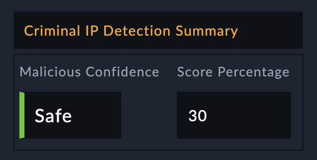

## About the connector
Criminal IP provides cyber threat intelligence search engine through which you can scan IP, domain, urls.

This document provides information about the Criminal IP Connector, which facilitates automated interactions, with a Criminal IP server using FortiSOAR&trade; playbooks. Add the Criminal IP Connector as a step in FortiSOAR&trade; playbooks and perform automated operations with Criminal IP.

### Version information

Connector Version: 1.0.0

FortiSOAR&trade; Version Tested on:

Criminal IP Version Tested on: 

Authored By: Fortinet

Certified: No
## Installing the connector

Use the <strong>Content Hub</strong> to install the connector. For the detailed procedure to install a connector, click <a href="https://docs.fortinet.com/document/fortisoar/0.0.0/installing-a-connector/1/installing-a-connector" target="_top">here</a>.

You can also use the <code>yum</code> command as a root user to install the connector:

<pre>yum install cyops-connector-criminal-ip</pre>

## Prerequisites to configuring the connector
- You must have the credentials of Criminal IP server to which you will connect and perform automated operations.
- The FortiSOAR&trade; server should have outbound connectivity to port 443 on the Criminal IP server.

## Minimum Permissions Required
- Not applicable

## Configuring the connector
For the procedure to configure a connector, click [here](https://docs.fortinet.com/document/fortisoar/0.0.0/configuring-a-connector/1/configuring-a-connector)
### Configuration parameters

In FortiSOAR&trade;, on the Connectors page, click the <strong>Criminal IP</strong> connector row (if you are in the <strong>Grid</strong> view on the Connectors page) and in the <strong>Configurations</strong> tab enter the required configuration details:

<table border=1><thead><tr><th>Parameter</th><th>Description</th></tr></thead><tbody><tr><td>Server URL</td><td>Specify the server url to which you want to connect and perform automated information.
</td>
</tr><tr><td>API Key</td><td>Specify the Criminal IP API Key through which you will connect and perform actions.
</td>
</tr><tr><td>Verify SSL</td><td>Specifies whether the SSL certificate for the server is to be verified or not.  By default, this option is set to True.</td></tr>
</tbody></table>

## Actions supported by the connector
The following automated operations can be included in playbooks and you can also use the annotations to access operations from FortiSOAR&trade; release 4.10.0 and onwards:
<table border=1><thead><tr><th>Function</th><th>Description</th><th>Annotation and Category</th></tr></thead><tbody><tr><td>Get URL Reputation</td><td>Uploads a URL to Criminal IP and retrieves the analysis results.</td><td>get_url_reputation  Investigation</td></tr>
<tr><td>Get IP Reputation</td><td>Uploads a IP to Criminal IP and retrieves the analysis results.</td><td>get_ip_reputation  Investigation</td></tr>
<tr><td>Get Domain Reputation</td><td>Uploads a domain to Criminal IP and retrieves the analysis results.</td><td>get_domain_reputation  Investigation</td></tr>
</tbody></table>

### operation: Get URL Reputation
#### Input parameters
<table border=1><thead><tr><th>Parameter</th><th>Description</th></tr></thead><tbody><tr><td>URL</td><td>Specify the URL to retrieve its reputation information from Criminal IP.
</td></tr></tbody></table>

#### Output

 The output contains a non-dictionary value.
### operation: Get IP Reputation
#### Input parameters
<table border=1><thead><tr><th>Parameter</th><th>Description</th></tr></thead><tbody><tr><td>IP</td><td>Specify the IP address to retrieve its reputation information from Criminal IP.
</td></tr></tbody></table>

#### Output

 The output contains a non-dictionary value.
### operation: Get Domain Reputation
#### Input parameters
<table border=1><thead><tr><th>Parameter</th><th>Description</th></tr></thead><tbody><tr><td>Domain</td><td>Specify the domain to retrieve its reputation information from Criminal IP.
</td></tr></tbody></table>

#### Output

 The output contains a non-dictionary value.
## Included playbooks
The `Sample - criminal-ip - 1.0.0` playbook collection comes bundled with the Criminal IP connector. These playbooks contain steps using which you can perform all supported actions. You can see bundled playbooks in the **Automation** > **Playbooks** section in FortiSOAR&trade; after importing the Criminal IP connector.

- Domain > Criminal IP > Enrichment
- Get Domain Reputation
- Get IP Reputation
- Get URL Reputation
- IP Address > Criminal IP > Enrichment
- URL > Criminal IP > Enrichment

**Note**: If you are planning to use any of the sample playbooks in your environment, ensure that you clone those playbooks and move them to a different collection since the sample playbook collection gets deleted during connector upgrade and delete.

## Pluggable Enrichment

The <em><code>Sample - Criminal IP - 1.0.0</code></em> playbook collection contains pluggable enrichment playbooks that are used to provide verdicts for indicator types IP Address, URL, and Domain. The pluggable enrichment playbooks are in the format: <strong><em>indicatorType</em> > Criminal IP > Enrichment</strong>. For example, <strong><em>Domain / IP / URL</em> > Criminal IP > Enrichment</strong>.

The Configuration step in all the pluggable enrichment playbooks contains variables that have default values for calculating the Verdict for various indicator types. 

<h3>Default variables for all supported indicator types</h3>

The Criminal IP integration API response returns the <code>verdict</code>, <code>cti_score</code>, <code>enrichment_summary</code>, and other variables as listed in the following table:

<table border="1">
    <tr>
        <th>Variable Name</th>
        <th>Description</th>
        <th>Return Value</th>
    </tr>
    <tr>
        <td><code>verdict</code></td>
        <td>This connector returns a high-reliability value called <code>verdict</code>. Use this verdict to find the reputation of the various types of indicators.</td>
        <td>
        
if the value in <code>vars.steps.Get_Reputation.data.data.main_domain_info.domain_score['score']</code> == <code>critical</code> then the verdict returned is <em>Malicious</em>

        
if the value in <code>vars.steps.Get_Reputation.data.data.main_domain_info.domain_score['score']</code> == <code>low</code> then the verdict returned is <em>Suspicious</em>

        
if the value in <code>vars.steps.Get_Reputation.data.data.main_domain_info.domain_score['score']</code> == <code>safe</code> then the verdict returned is <em>Good</em>

        
For any other value, return the verdict as <em>No Reputation Available</em>

        </td>
    </tr>
    <tr>
        <td><code>cti_name</code></td>
        <td>The name of the connector is called the CTI (Cyber Threat Intelligence) name</td>
        <td><code>Criminal IP</code></td>
    </tr>
    <tr>
        <td><code>cti_score</code></td>
        <td>The verdict value returned by the integration API.</td>
        <td>
            
Returns the value in <code>vars.steps.Get_Reputation.data.data.main_domain_info.domain_score['score']</code>. If no value is available, it returns an empty value.

        </td>
    </tr>
    <tr>
        <td><code>source_data</code></td>
        <td>The <code>source_data</code> response returned by the integration API.</td>
        <td>A JSON response object containing the source data of the threat intelligence integration.</td>
    </tr>
    <tr>
        <td><code>field_mapping</code></td>
        <td>The mapping of the FortiSOAR <em>Indicator</em> module fields with the MISP Intelligence response fields.</td>
        <td>A JSON response object containing the field mapping of the threat intelligence integration.</td>
    </tr>
    <tr>
        <td><code>enrichment_summary</code></td>
        <td>The contents that are added, in the HTML format, in the <em>Description</em> field of the specified FortiSOAR indicator record.</td>
        <td>
        
The following values are returned to the HTML format:

        <ul>
            <li>Malicious</li>
            <li>Suspicious</li>
            <li>Good</li>
        </ul>
        
The following image displays a sample of the populated <em>Description</em> field in a FortiSOAR indicator record:

        
</td>
    </tr>
</table>
